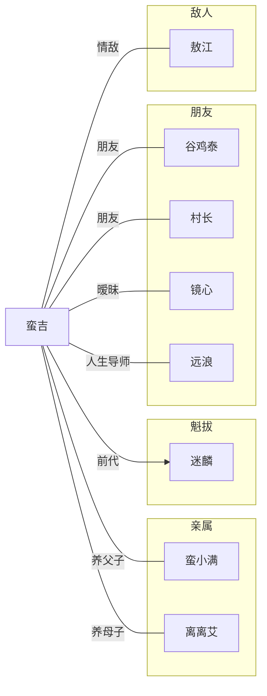

<!-- 人物摘要 -->
蛮吉是《魁拔》系列作品中《魁拔之十万火急》、《魁拔之大战元泱界》、《魁拔之战神崛起》、的主角，蛮吉第六代魁拔的身份是贯穿魁拔动漫电影的线索，蛮吉是推动魁拔动漫电影剧情走向的重要人物。通过系列动漫电影的剧情走向，蛮吉将会接连遇到第四代魁拔旧部——魁拔十二妖，从而勾连出第四代魁拔时期的往事将整个魁拔故事连为一体。
<!-- more -->

<!-- 基本信息 -->
# 基本信息

- **姓名**: 蛮吉
- **性别**: 男
- **种族**: 魁拔

<!-- 登场作品 -->
# 登场作品

- 《魁拔之十万火急》
- 《魁拔之大战元泱界》
- 《魁拔之战神崛起》
- 

<!-- 人物关系图 -->
# 人物关系图


- **CN-traveler**
    - 人物摘要：自述
    - 基本信息：《魁拔之十万火急》、《魁拔之大战元泱界》、《魁拔之战神崛起》
    - 登场作品：《魁拔之十万火急》、《魁拔之大战元泱界》、《魁拔之战神崛起》
    - 人物关系图：《魁拔人物关系图》


